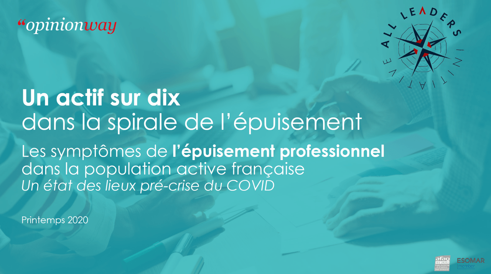

#### … et ce avant même la crise du COVID et son sillage d’anxiété, d’incertitudes et d’inconforts…

Avec cette étude menée à l’hiver 2019 par l’institut _OpinionWay_ en collaboration avec _All Leaders Initiative_, prenez une **première mesure des enjeux de l’épuisement professionnel au travail**.

L’épuisement professionnel ou « burn-out » est une question sensible : un mal lancinant au sein de la population active mais finalement méconnu.  
Il s’agit en effet d’un syndrome complexe avec de multiples définitions que l’on peut synthétiser comme la conséquence de l’exposition à un **stress prolongé manifestée par un épuisement physique et psychique**.

Alors que les **enjeux sanitaires** (souffrances individuelles, arrêts de travail de longue durée avec risque d’isolement, …) et **économiques** (impact sur l’absentéisme, la productivité, …) sont majeurs, peu de sources objectives permettent de dresser un état des lieux au sein de la population active française de ce syndrome complexe mais ayant des caractéristiques et des manifestations reconnaissables.

**Cette enquête est ainsi inédite dans sa mesure de la perception des manifestations caractéristiques de l’épuisement professionnel** (symptômes cognitifs, émotionnels et physiques).  
Il s’agit de contribuer ainsi à une **prise de conscience de l’ampleur du phénomène** et de la nécessité de sa prise en compte par l’**établissement des conditions d’une véritable sécurité psychologique**, tant il s’agit toujours d’une rencontre entre une personnalité et un environnement de travail à risque.

[_**Contactez-nous pour étudier les possibilités d’une mesure ou détection et d’un accompagnement dédiés à votre entreprise dans ce contexte particulièrement sensible.**_](https://old.all-leaders.fr/contact/)

## Etude Opinionway-All Leaders Initiative Epuisement professionnel

#### **Télécharger le rapport complet de l'étude**

  Téléchargement gratuit
