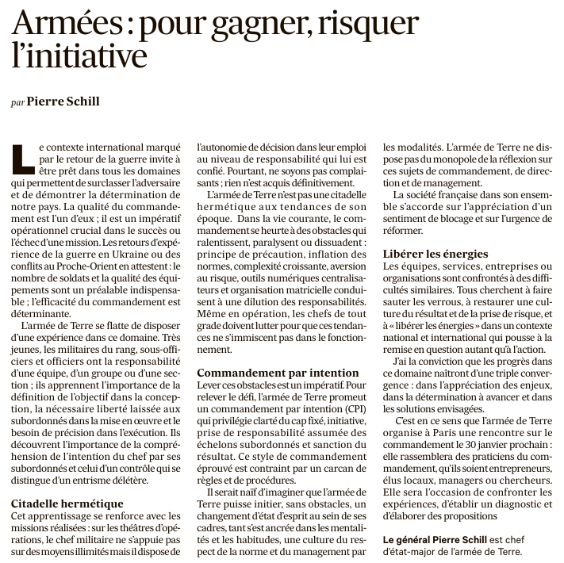

## La notion d’intention, et la nécessité de la rencontre entre intention descendante (vision, mission, objectif général…) et intentions montantes (contributions, initiatives, propositions, …) est l’essence de l’efficacité collective de toute organisation.

Cette conception est **au coeur de l’approche de All Leaders Initiative**, et si vous nous connaissez déjà, vous savez que l’inspiration du monde de la mer, de l’esprit d’équipage propre à la Marine nationale est pour nous une étroite et chère source d’inspiration pour de nombreuses raisons...

Mais nous ne sommes pas sectaires pour autant ;-) et relayons donc volontiers cette **rencontre organisée par l’armée de Terre ces jeudi 29 et vendredi 30 janvier**.

Elle rassemble autour du thème du commandement par intention de nombreux praticiens, militaires, managers, chercheurs, etc.

La rencontre est disponible en [replay sur YouTube](https://www.youtube.com/watch?v=pxVbdcjfyWc&list=PLOwiBOdMBHyfuEcuChm3ORu4EoIQvnG5h) et ci-dessous, et nous ajoutons la tribune / annonce parue dans **Les Echos** du 27 janvier signée du **général Schill, Chef d’état major de l’armée de Terre.**

\[embed\]https://www.youtube.com/watch?v=pxVbdcjfyWc&list=PLOwiBOdMBHyfuEcuChm3ORu4EoIQvnG5h\[/embed\]

## Pour en savoir plus ...

[  
Contactez-nous !  
](https://all-leaders.fr/contact/)
