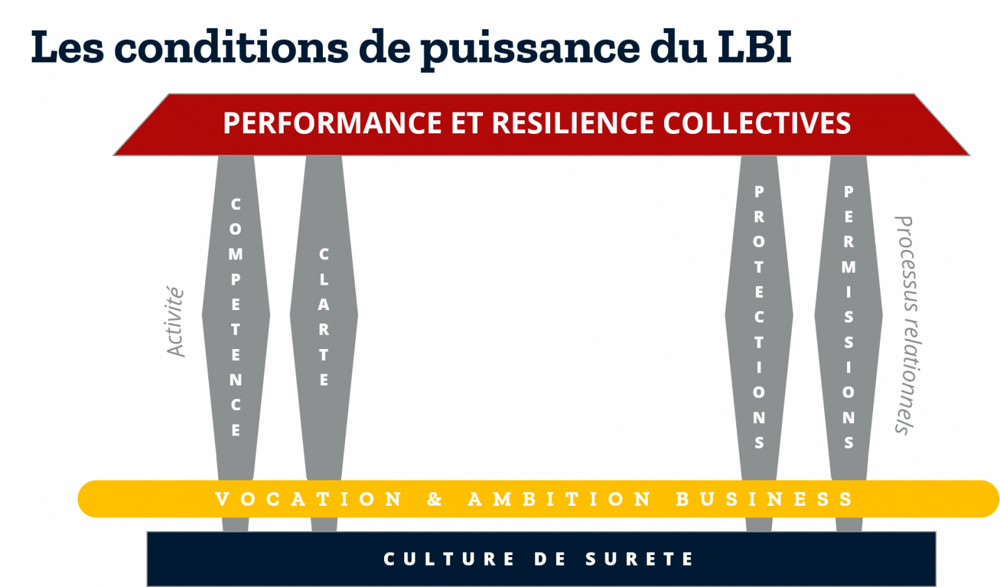

#### **Pour finir notre série sur les attributs de l’intention, récapitulons les conditions qui permettent d’exprimer toute la puissance du « Leadership basé sur l’intention », qui sous-tend les interventions de All Leaders Initiative.**

#### _Retrouver les 5 premiers « pourquoi intention dans Leadership basé sur l’intention ? » ici :_  
_– [Implication personnelle / Appropriation](https://all-leaders.fr/puissance-de-l-intention-1-implication-personnelle-et-appropriation/)_  
_– [Orientée action](https://all-leaders.fr/puissance-de-l-intention-2-orientee-action/)_  
_– [Contrôlée](https://all-leaders.fr/puissance-de-l-intention-3/)_  
_– [Échange](https://all-leaders.fr/la-puissance-de-l-intention-4-echange-d-intentions/)_  
_– [Protections réciproques](https://all-leaders.fr/puissance-de-l-intention-5-protections-reciproques/)_

Toute entreprise ou organisation part naturellement d’**une vocation et d’une ambition « business »**. Celle du fondateur ou celle qui reste la mission du collectif.

Plusieurs éléments sont indispensables à la réalisation de cette ambition, comme autant de **piliers** :

## Conditions de puissance

### **Une première paire de piliers concerne l’activité** même de l’organisation (le « quoi ? ») :

- Il s’agit d’une part des **compétences** techniques, individuelles et collectives, pour mettre en œuvre pratiquement cette ambition – propres au métier de l’organisation, et généralement pas le champ des interventions de All Leaders Initiative, à la différence des autres éléments.

- Et de la **clarté**. Indispensable à différents niveaux : celui des objectifs et buts globaux (les « intentions » liées à la mission). Mais également clarté organisationnelle (en substance : qui fait et est responsable de quoi…). Et enfin, parfois trop négligée, clarté du contexte : il est indispensable que chacun dans l’organisation ait accès aux informations nécessaires à la compréhension du contexte et de l’environnement de l’organisation. Cela seul permet d’ancrer les intentions globales dans le concret.

### **La deuxième paire de piliers porte sur les processus relationnels** indispensables à la bonne conduite de l’activité (le « comment ? »).

Ils consistent en la combinaison des protections et des permissions nécessaires à la facilitation et la régulation des relations :

- Par **« protections »**, nous entendons les règles du jeu de l’organisation pour ce qui relève du « non » : les limites à ne pas franchir, ce qu’il ne faut pas faire, les erreurs graves à ne pas commettre pour leur gravité, etc.

- Les **« permissions »** viennent en regard éclairer tout ce qui relève du « oui », ce qu’on peut faire, initier, expérimenter, tenter…

Cette double clarification est indispensable pour ne pas rencontrer la situation réellement observée de ce senior manager enjoignant à « questionner le statuquo » dans une organisation tout juste renouvelée assez brutalement : à son grand dam, cette « permission » sans « protection » est bien-sûr restée lettre morte…

### **Pour assurer leur solidité, ces quatre piliers (conditions de puissance) ont besoin de** **fondations robustes**.

C’est le développement d’une véritable **culture de sûreté** (voir [ici](http://le-role-majeur-de-la-culture-de-surete-pour-anticiper-des-risques)) qui fournit ces fondations. En apportant la capacité à anticiper les risques notamment par un climat de sécurité psychologique, la culture de sûreté favorise la performance et la résilience de manière collective dans un monde dans lequel _« les risques sont trop nombreux et évoluent trop rapidement pour être prédits, même par le dirigeant le plus clairvoyant »_ (1).

Ensemble de valeurs, process, attitudes et comportements, la culture de sûreté exige un soin et un développement permanents.

#### C’est la conjugaison de tous ces éléments cristallisée par le _« Leadership basé sur l’intention »_ qui favorise l’implication, l’engagement et la confiance et finalement **la performance et la résilience de l’organisation**, en permettant, pour reprendre une expression anglo-saxonne à succès, d’**opposer un autre « VUCA »** **au monde « Volatile, Uncertain, Complex et Ambiguous » : celui de la vision, de la compréhension, de la clarté et de l’agilité (« Vision, Understanding, Clarity, Agility »).** (2)

_(1) : extrait de la Collection sécurité nucléaire de l’Agence Internationale de l’Energie Atomique (AIEA) n°28-T_  
_(2) : expression empruntée à notre confrère de ReMarkable Stuart Pownall_
