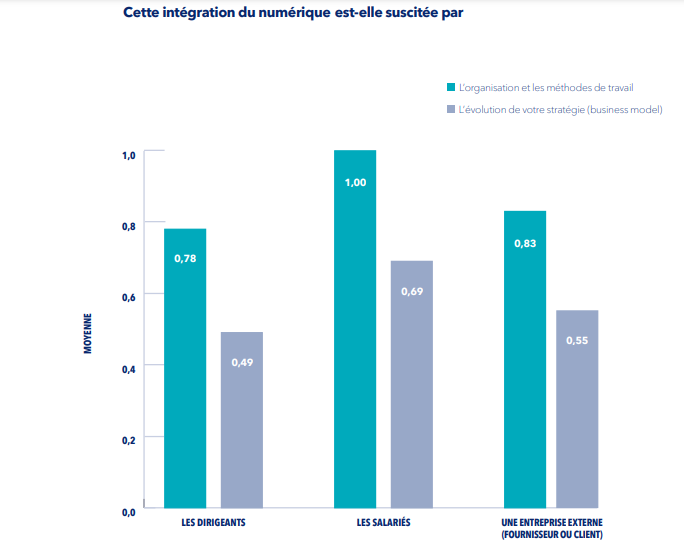

#### **Aller au-delà de la dématérialisation pour une « vraie » digitalisation, un chemin qui passe par la mobilisation des collaborateurs !**

Une vaste étude récente intitulée _“Quelles clés pour transformer les entreprises digitalisées en entreprises numériques ?” \*_ pointe un phénomène préoccupant : une minorité d’entreprises mettent en place une véritable stratégie digitale.  
Le plus souvent, la digitalisation reste plus une forme de dématérialisation des modes de fonctionnement existants qu’une véritable mobilisation des nouvelles capacités du numérique pour perfectionner aussi bien les processus organisationnels que le business model.  
Or l’étude pointe qu’une des clés majeures d’une véritable transformation digitale féconde repose sur l’implication et la mobilisation des collaborateurs :

> « les entreprises pour lesquelles l’intégration du numérique est menée par les salariés (voir tableau ci après) sont celles qui attribuent les scores les plus élevés concernant l’impact de la digitalisation sur l’organisation et sur l’évolution de la stratégie respectivement 1 et 0,69 contre seulement 0,83 et 0,55 quand l’intégration est portée par une entreprise extérieure et seulement 0,78 et 0,49 lorsqu’elle est portée par les dirigeants eux-mêmes. Dans plus de 80 % des entreprises interrogées, ce sont les dirigeants qui portent majoritairement la responsabilité de l’intégration des outils digitaux. Les salariés doivent donc être beaucoup mieux intégrés à la réflexion sur la transformation numérique de leur entreprise. »

S’appuyer sur les collaborateurs qui connaissent les besoins et peuvent faire émerger de nouvelles pratiques fondées sur les outils digitaux. Il s’agit là d’un véritable enjeu de mobilisation et de co-construction au cœur des approches de facilitation en intelligence collective et de coaching d’organisation pratiquées par All Leaders Initiative !

[Retrouver l’étude complète sur le site EM Normandie](https://blog.ecole-management-normandie.fr/fr/digital-transformation-numerique/quelles-cles-pour-transformer-les-entreprises-digitalisees-en-entreprises-numeriques/).

Nous contacter pour en savoir plus sur [comment accompagner la digitalisation par le facteur humain…](https://all-leaders.fr/contact/)

##### _(\*) Etude « [Quelles clés pour transformer les entreprises digitalisées en entreprises numériques ?](https://blog.ecole-management-normandie.fr/fr/digital-transformation-numerique/quelles-cles-pour-transformer-les-entreprises-digitalisees-en-entreprises-numeriques/) »_. P_ubliée fin mai 2022 par la chaire Digitalisation et Innovation dans les Organisations et les Territoires de l’EM Normandie, à partir d’une enquête menée par l’Observatoire des Transformations Numériques en février mars 2021 auprès de plus de 2.000 entreprises constituant un échantillon représentatif._

###### Illustration : Conny Schneider unsplash.com
