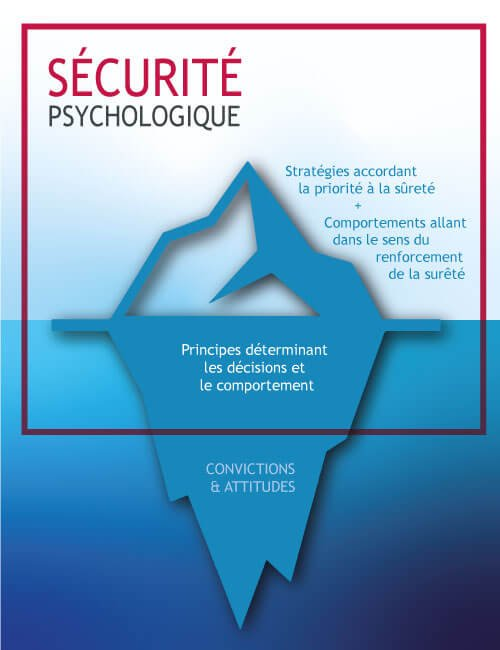
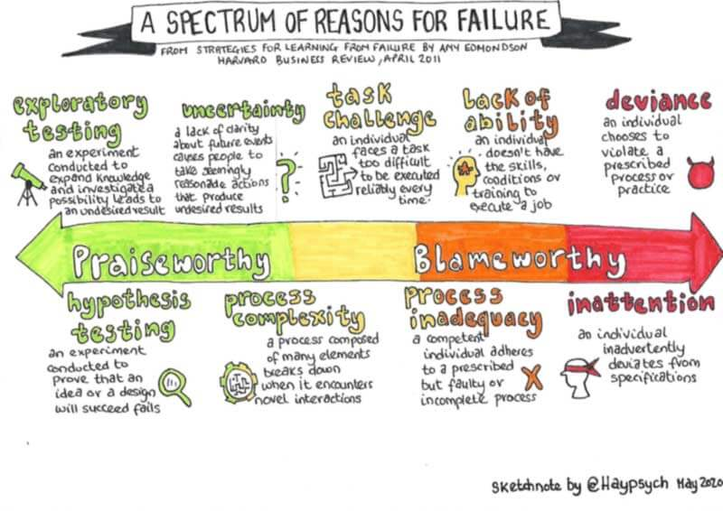

Augmenter la sûreté d’une organisation, sa pérennité par rapport à un évènement qui pourrait mettre son existence en défaut, en travaillant avec les équipes autour des fondamentaux que sont :

- La clarté des enjeux liés à la nature du travail

- Le rapport aux erreurs

- Les comportements et attitudes managériaux

- Les comportements et attitudes entre collaborateurs

- Les systèmes et structures de l’environnement de travail

MODÈLE DE CULTURE DE SÛRETÉ

#### COMMENT Y PARVENIR ?

L’engagement, le sentiment de responsabilité ou la créativité ne se commandent pas. Il est donc nécessaire de créer et d’entretenir au quotidien un environnement pour :

- permettre aux collaborateurs de s'exprimer sur les questions qui les animent, leurs doutes voire leurs erreurs en mettant en place la sécurité psychologique

- et leur laisser l'occasion de prendre conscience de ce qui fonctionne bien chez eux, individuellement et collectivement, de manière à augmenter les réussites et comportements performants en prônant l’« [appreciative inquiry ».](https://www.ifai-appreciativeinquiry.com/appreciative-inquiry/approche)

Ceci permet de travailler les fondamentaux (préférentiellement par le biais d’auto-questionnements) de la culture de sûreté, dernier rempart contre la complexité de la menace.

> La culture de sûreté aide l’organisation à ne pas se laisser dépasser par un environnement de menace dans lequel les risques sont trop nombreux et évoluent trop rapidement pour être prédits, même par le dirigeant le plus clairvoyant.
> 
> – Agence Internationale de l’Energie Atomique, 1990
