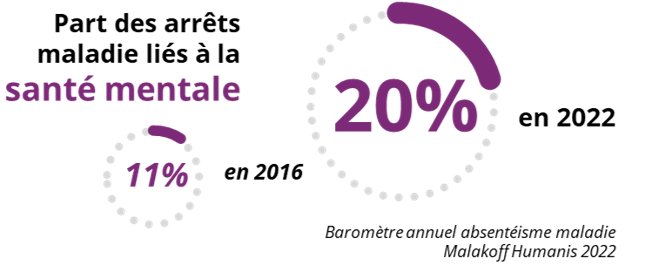
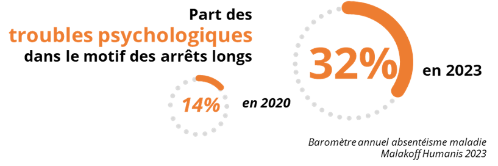
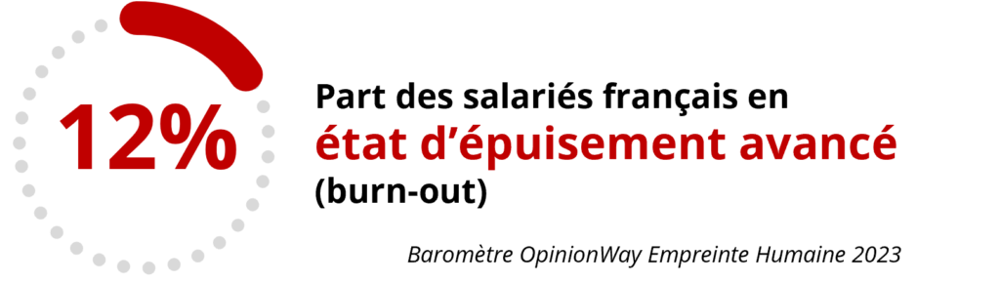
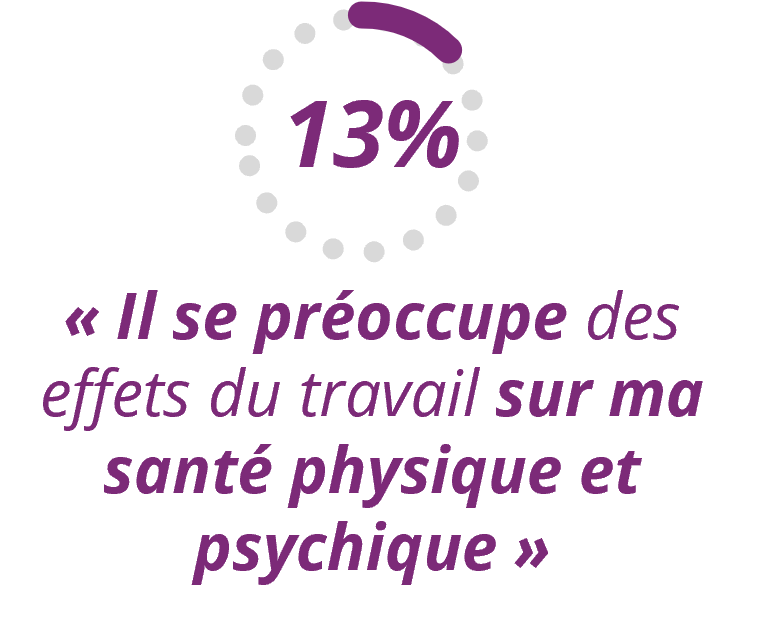
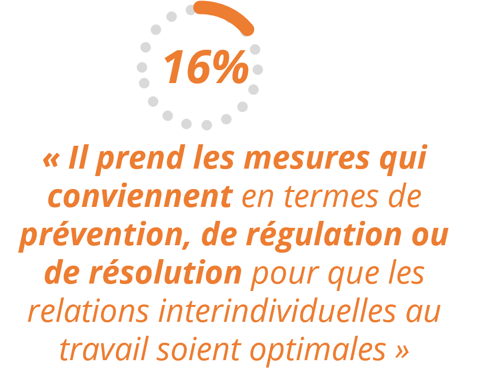
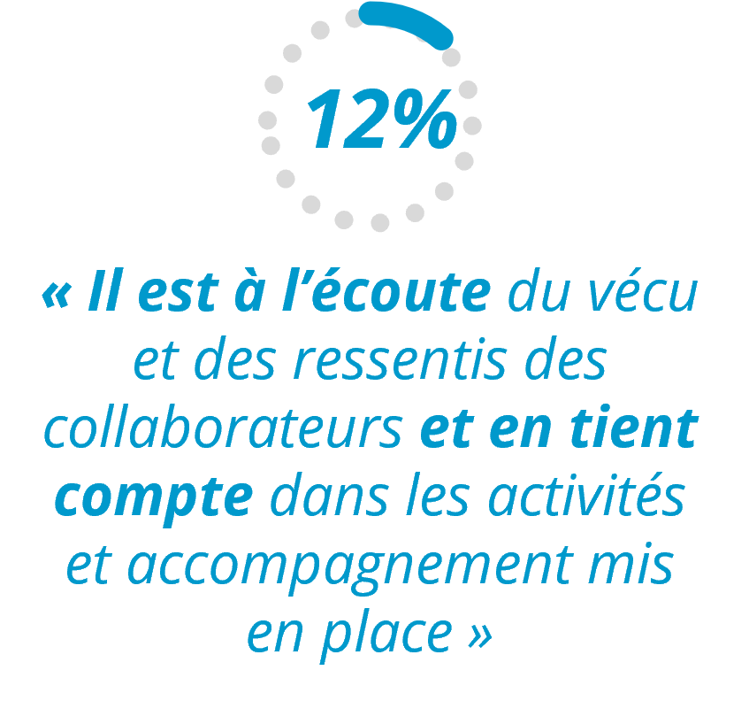
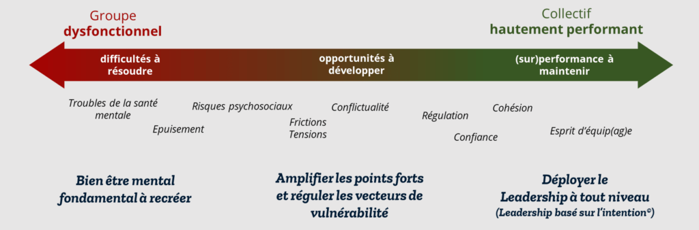

### Encore résolument tabou il y a peu, la question du bien-être psychique et de la santé mentale au travail est entrée en pleine lumière depuis la crise Covid...

De fait, **les signaux préoccupants sont nombreux**, avec des conséquences multiples désormais bien renseignées : 

   

Les **collaborateurs ont une perception de plus en plus prégnante** de ces problématiques :

 

Cela ne les empêche pas de **douter de la réelle préoccupation de leur employeur,** comme le montrent ces chiffres sur la part des salariés « tout à fait d’accord » avec les affirmations suivantes à son propos (chiffres recueillis dans une enquête OpinionWay pour All Leaders Initiative / EOL auprès d'un échantillon représentatif des salariés des secteurs privé et public en France en 2022 ) :

  

### Cet enjeu doit être appréhendé dans sa dimension globale

Celle du développement d’**un travail de qualité, sain et soutenable** pour ses acteurs, englobant à la fois les **conditions** de travail, la **qualité des relations** au travail, et le **sens** pouvant lui être donné.

Rappelons afin d'éviter tout procès en _"bisounouserie"_ que la performance collective ne se déploie que dans un environnement où règne une sécurité psychologique suffisante, [comme nombre de nos travaux le soulignent](https://all-leaders.fr/impact-de-la-securite-psychologique-dans-la-performance-dequipe-et-lexcellence-organisationnelle/), éléments probants à l'appui.

**La qualité du travail et la santé des collaborateurs et du management sont bien le garant de la qualité et de la santé d'une organisation et de sa performance globale, à l'alignement des enjeux économiques et sociaux.**

Pour aller plus loin

**Chez All Leaders Initiative, nous intervenons sur l'ensemble du continuum de l'efficacité collective.**

Nous avons ainsi développé, pour intervenir sur la partie gauche  de ce spectre de situations en fonction des contextes et enjeux, un **ensemble de prestations dédiées au bien-être psychique et à la santé mentale au travail**. Nous vous invitons à [les consulter ici](https://all-leaders.fr/accompagnements/bien-etre-psychique-et-sante-mentale-au-travail/) et à nous contacter pour envisager un accompagnement, ou simplement commencer par en parler...

## Nous pouvons vous aider à définir un accompagnement sur mesure.

[Contactez-nous](https://all-leaders.fr/contact/)

###### Photo de [Gadiel Lazcano](https://unsplash.com/fr/@gadiellv?utm_content=creditCopyText&utm_medium=referral&utm_source=unsplash) sur [Unsplash](https://unsplash.com/fr/photos/homme-en-chemise-noire-assis-sur-une-chaise-ulPAVuxITEw?utm_content=creditCopyText&utm_medium=referral&utm_source=unsplash)
