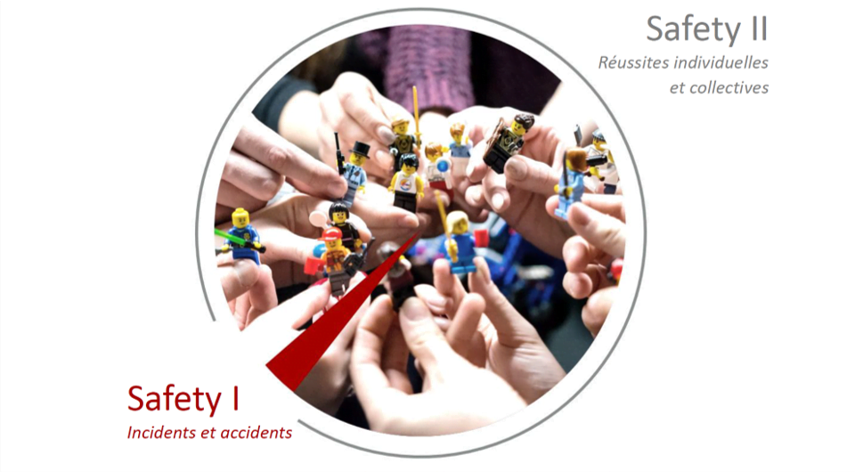
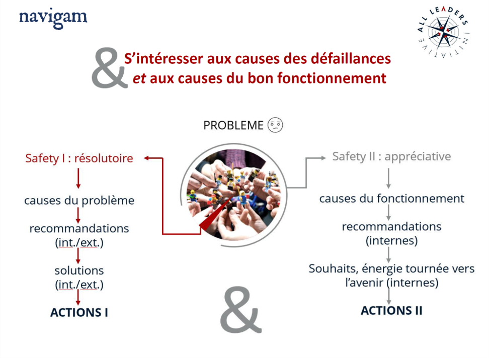

**En matière de sureté, il faut savoir apprécier et valoriser les comportements gagnants !** Car bien heureusement, il n’y a pas que les accidents dans la vie ! Certes, identifier au plus tôt les dérives et dysfonctionnements qui pourraient conduire à des incidents puis accidents est essentiel pour chaque organization.

En analyser les causes et mettre en place des barrières techniques ou organizationnelles est évidemment incontournable.

**Mais ce n’est clairement pas suffisant.**

Pour nous (nous ne l’avons pas inventé\* mais rarement entendu mettre en avant), pour bien embrasser la culture de sûreté, **il est nécessaire aussi d’aller investiguer les causes de… ce qui fonctionne.**

Pour le dire simplement, quand ça fonctionne, malgré la variabilité de l’environnement de travail et les aléas du quotidien, avez-vous les idées claires à propos de…

- *Comment* ça fonctionne ?

- Quels en sont les *ingrédients* ?

- Les sources de *satisfaction* ?

- Les *comportements* vécus que vous – et les collaborateurs – souhaitez –  valoriser et mettre en place de manière aussi visible que ceux à éviter ?

L’analyse du retour d’expérience d’un secteur ou d’une organization n’est pas complet si on ne prend pas également ces paramètres en compte.

 **Pensez à apprécier et valoriser les comportements gagnants !** 

\* : voir notamment : *From Safety I  to Safety II : A White Paper. Hollnagel, Wears & Braithwaite, technical report, jan 2015*
